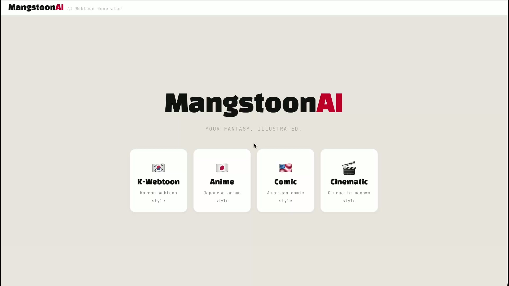

# MangstoonAI — AI Webtoon Generator

> **3rd Place — Gemini 3 Seoul Hackathon (Feb 28, 2026) — $20,000 Google Cloud Credits**

Turn your wildest fantasy into a full webtoon — starring yourself — in under a minute.

[](https://youtu.be/L9gxk6dSrbw)

**[Watch the demo →](https://youtu.be/L9gxk6dSrbw)**

---

## What is 망상?

In Korean, **망상** (mangstoon) means your wildest, most embarrassing fantasy — the one you replay in your head but would never tell anyone.

MangstoonAI turns that into a scroll-style Korean webtoon. Type your story, upload a selfie, pick an art style, and watch as AI generates a 20+ panel webtoon where **you** are the main character. Then edit any panel with natural language.

---

## How It Works

```
[Story Text + Selfie]
        │
        ▼
[decompose_story]  →  22-panel storyboard (5-act structure, JSON)
        │                characters, scenes, dialogue, camera angles, mood
        ▼
[generate_panel × 22]  →  all panels in parallel:
        │                    1. Flash optimizes image prompt
        │                    2. Flash Image generates 9:16 panel
        ▼
[Webtoon Output]  →  22 panels in scroll format + speech bubbles
        │
        ▼
[Edit]  →  "5번 패널 배경을 한강으로" → regenerates just that panel
```

---

## 4 Art Styles

| Style | Best For |
|-------|----------|
| **K-Webtoon** (default) | Romance, slice-of-life, comedy |
| **Anime** | Action, shōnen/shōjo |
| **Comic** | Superhero, sci-fi, noir |
| **Cinematic** | Fantasy, power-fantasy, thriller |

---

## Tech Stack

| Component | Technology |
|-----------|-----------|
| **Agent Framework** | Google ADK |
| **Orchestrator** | Gemini 3.1 Pro (low thinking) |
| **Storyboard** | Gemini 3 Flash (low thinking) |
| **Image Generation** | Gemini 3.1 Flash Image |
| **Backend** | FastAPI on Cloud Run (Seoul) |
| **Frontend** | Next.js 14 on Vercel |
| **Image Storage** | Google Cloud Storage |
| **CI/CD** | GitHub Actions + Workload Identity Federation |

---

## Architecture

```
mangstoon_ai/
├── agent.py              # root_agent (Gemini 3.1 Pro, 3 tools)
├── styles.py             # 4 art style definitions
├── gcs.py                # GCS upload utility
├── tools/
│   ├── story_engine.py   # decompose_story() — text → 22-panel storyboard
│   ├── image_gen.py      # generate_panel() — 2-step: optimize prompt → gen image
│   ├── panel_editor.py   # edit_panel() — 2-step: edit prompt → regen image
│   └── character.py      # extract_character() — selfie → character description
└── prompts/
    └── system.py         # 3-phase director: Brainstorm → Generate → Edit
```

### Key Design Decisions

- **2-step prompt pipeline**: Each panel goes through a Flash prompt optimizer before image generation — narrative paragraphs, not keyword lists
- **Face/outfit separation**: Face description is permanent identity; outfit varies per scene for visual variety
- **Parallel generation**: All 22 panels fire simultaneously via `asyncio.gather()` — under 1 minute total
- **Agent + direct call hybrid**: Agent handles creative story decomposition, then we break out of the event stream and do image gen in parallel ourselves

---

## Quick Start

### Prerequisites

- Python 3.12+
- [uv](https://docs.astral.sh/uv/) (Python package manager)
- Node.js 18+
- A [Google AI Studio](https://aistudio.google.com/) API key

### Setup

```bash
# Clone
git clone https://github.com/jays0606/mangstoon_ai.git
cd mangstoon_ai

# Backend — set API key
echo "GOOGLE_API_KEY=your_key_here" > backend/.env

# Install Python deps
cd backend && uv sync && cd ..

# Install frontend deps
cd frontend && npm install && cd ..
```

### Run Locally

```bash
# Option 1: ADK Dev UI (interactive agent chat)
cd backend && uv run --project .. adk web --port 8080
# → http://localhost:8080/dev-ui/  →  select mangstoon_ai

# Option 2: FastAPI backend + Next.js frontend
cd backend && ./run.sh          # port 8000
cd frontend && npm run dev      # port 3000
# → http://localhost:3000
```

---

## API

### POST /generate (multipart/form-data)

| Field | Type | Description |
|-------|------|-------------|
| `story` | string | Your fantasy / story text |
| `style` | string | `k-webtoon`, `anime`, `comic`, or `cinematic` (default: `k-webtoon`) |
| `selfie` | file | Optional selfie photo — you become the main character |

Returns 22 panels with `image_url`, `dialogue`, `scene_description`, `camera_angle`, `mood`, and more.

### POST /edit (JSON)

| Field | Type | Description |
|-------|------|-------------|
| `panel_number` | int | Which panel to edit |
| `instruction` | string | Natural language edit (e.g., "배경을 한강 야경으로 바꿔줘") |
| `scene_description` | string | Current scene context |
| `character_info` | string | Character description |
| `character_state` | string | Current character state |
| `style` | string | Art style |

Returns the regenerated panel with a new `image_url`.

---

## Deployment

The app is deployed as:
- **Backend**: Cloud Run (Seoul / asia-northeast3)
- **Frontend**: Vercel (auto-deploys on push to main)
- **Images**: GCS bucket (public read, Seoul region)
- **CI/CD**: Push to `main` → GitHub Actions → Cloud Run deploy

To deploy your own instance, set up:
1. A GCP project with Cloud Run, GCS, and Secret Manager
2. Workload Identity Federation for GitHub Actions auth
3. GitHub secrets: `WIF_PROVIDER`, `WIF_SERVICE_ACCOUNT`
4. Vercel project linked to the repo with `NEXT_PUBLIC_BACKEND_URL` env var

---

## License

Built at the Gemini 3 Seoul Hackathon, Feb 28 2026.
Powered by Google ADK + Gemini 3.1 Pro + Gemini 3.1 Flash Image.
